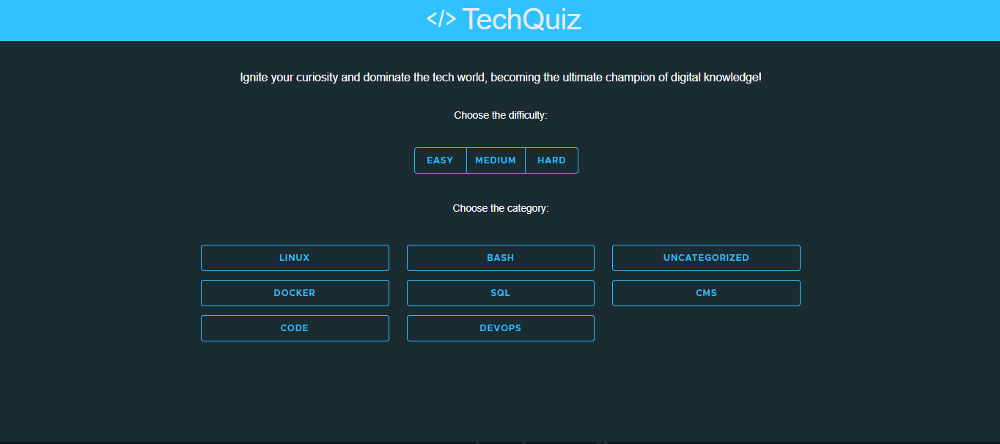

# Projeto: TechQuiz

> 1. Baixe este arquivo e edite o texto em formato Markdown conforme as instruções a seguir.
> 2. Substitua todos os trechos de texto iniciados com "Substitua" por informações do seu projeto, conforme solicitado em cada trecho.
> 3. Substitua a imagem por um screenshot do projeto (arquivo pode ser armazenado no repositório ou em URL externa). GIFs animados também são permitidos!
> 4. Remova todas as instruções de entrega.
> 5. Double-check: Certifique-se de que seu README.md não contenha instruções de entrega!
> 6. Entregue este README.md dentro da pasta raiz do repositório de entrega.
     > Opcional: é permitido alterar a formatação do README, desde que sejam mantidas todas as informações solicitadas (tudo bem adicionar mais informações)

Acesso: https://techquiz-l3hq.onrender.com

### Desenvolvedores

Bruna Caetano da Veiga e Vitória Regina Pizzutti Moraes | Sistemas de Informação

### Nosso produto

Uma das formas mais básicas de avaliar o seu aprendizado em alguma área é por meio de perguntas e respostas. É nesse contexto
que surge o TechQuiz, um sistema que permite validar seus conhecimentos em tecnologia por meio de um quiz.

Nesta aplicação, o usuário poderá selecionar tanto a categoria a categoria quanto a dificuldade das questões a serem
respondidas. Ao concluir o quiz, o usuário recebe um feedback sobre seu desempenho, além de ter a opção de refazer o quiz ou
avançar para níveis mais desafiadores de perguntas.

#### API escolhida

Para desenvolver este projeto, foi utilizada a [QuizAPI](https://quizapi.io/), uma API REST que provê questões da área de tecnologia.

A autenticação para ter acesso aos resultados dos _endpoints_ é feita passando uma _key_ como parâmetro por meio de _query string_.

O principal _endpoint_ dessa API é ``/api/v1/questions``, que retorna as questões em si. Através dele, é possível filtrar as
questões também utilizando parâmetros em _query string_.

As possibilidades de filtro são: categoria, dificuldade, tags e limite do número de questões.

Também será utilizado o _endpoint_ ``/api/v1/categories`` para receber todas as categorias de questões disponíveis na API.

### Desenvolvimento

Substitua este texto por uma descrição do processo de desenvolvimento, explicando decisões tomadas e etapas do trabalho.

#### Tecnologias

Substitua este trecho por uma lista detalhada de tecnologias usadas (tanto as básicas, como HTML e CSS, como as mais específicas, por exemplo algum framework para frontend, etc.):

- HTML
- CSS
- Angular
- Clarity Design System

#### Ambiente de desenvolvimento

- WebStorm

#### Referências e créditos

- https://angular.dev/
- https://clarity.design/
- https://developer.mozilla.org/

---
Projeto entregue para a disciplina de [Desenvolvimento de Software para a Web](http://github.com/andreainfufsm/elc1090-2024a) em 2024a
